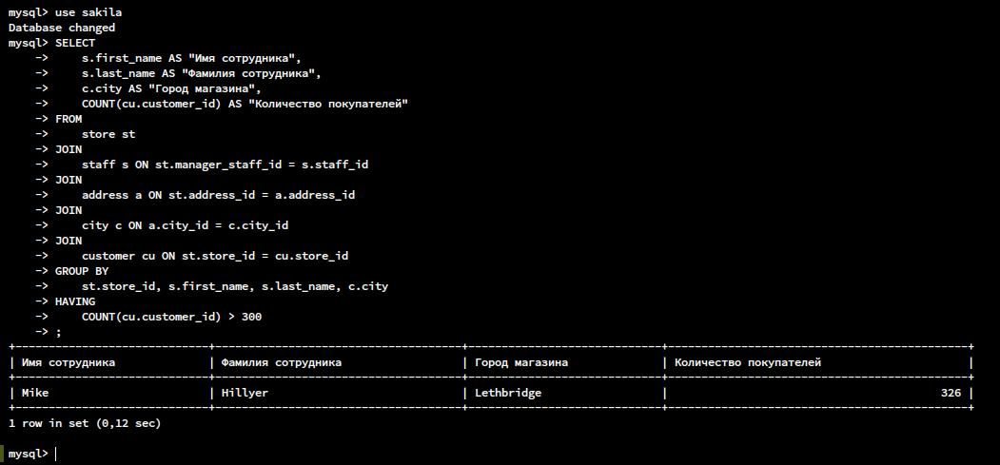
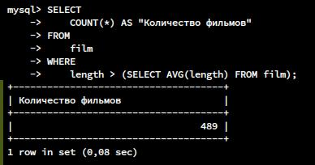
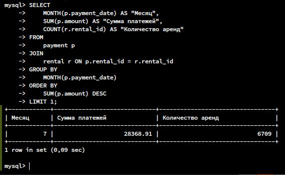
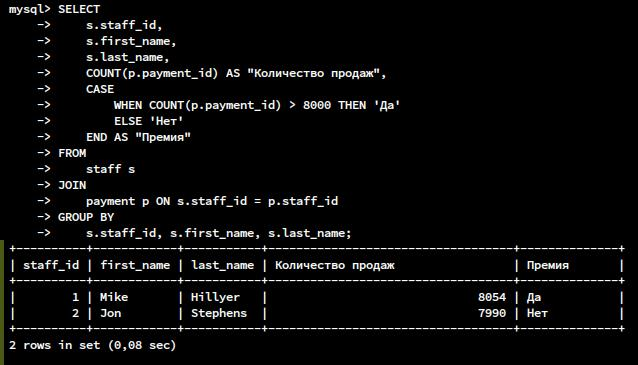
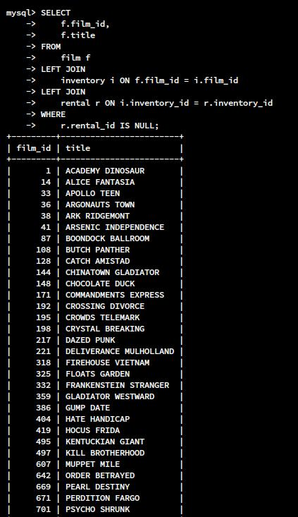

# Домашнее задание к занятию "`SQL. Часть 2`" - `Горелов Николай`


### Задание 1

Одним запросом получите информацию о магазине, в котором обслуживается более 300 покупателей, и выведите в результат следующую информацию: 
- фамилия и имя сотрудника из этого магазина;
- город нахождения магазина;
- количество пользователей, закреплённых в этом магазине.

---

### Решение 1

``` sql
SELECT 
    s.first_name AS "Имя сотрудника",
    s.last_name AS "Фамилия сотрудника",
    c.city AS "Город магазина",
    COUNT(cu.customer_id) AS "Количество покупателей"
FROM 
    store st
JOIN 
    staff s ON st.manager_staff_id = s.staff_id
JOIN 
    address a ON st.address_id = a.address_id
JOIN 
    city c ON a.city_id = c.city_id
JOIN 
    customer cu ON st.store_id = cu.store_id
GROUP BY 
    st.store_id, s.first_name, s.last_name, c.city
HAVING 
    COUNT(cu.customer_id) > 300;
```


---

### Задание 2

Получите количество фильмов, продолжительность которых больше средней продолжительности всех фильмов.

---

### Решение 2

``` sql
SELECT 
    COUNT(*) AS "Количество фильмов"
FROM 
    film
WHERE 
    length > (SELECT AVG(length) FROM film);
```


---

### Задание 3

Получите информацию, за какой месяц была получена наибольшая сумма платежей, и добавьте информацию по количеству аренд за этот месяц.

---

### Решение 3

```sql
SELECT 
    MONTH(p.payment_date) AS "Месяц",
    SUM(p.amount) AS "Сумма платежей",
    COUNT(r.rental_id) AS "Количество аренд"
FROM 
    payment p
JOIN 
    rental r ON p.rental_id = r.rental_id
GROUP BY 
    MONTH(p.payment_date)
ORDER BY 
    SUM(p.amount) DESC
LIMIT 1;
```


---

## Дополнительные задания (со звёздочкой*)
Эти задания дополнительные, то есть не обязательные к выполнению, и никак не повлияют на получение вами зачёта по этому домашнему заданию. Вы можете их выполнить, если хотите глубже шире разобраться в материале.

### Задание 4*

Посчитайте количество продаж, выполненных каждым продавцом. Добавьте вычисляемую колонку «Премия». Если количество продаж превышает 8000, то значение в колонке будет «Да», иначе должно быть значение «Нет».

---

### Решение 4*

``` sql
SELECT 
    s.staff_id,
    s.first_name,
    s.last_name,
    COUNT(p.payment_id) AS "Количество продаж",
    CASE 
        WHEN COUNT(p.payment_id) > 8000 THEN 'Да'
        ELSE 'Нет'
    END AS "Премия"
FROM 
    staff s
JOIN 
    payment p ON s.staff_id = p.staff_id
GROUP BY 
    s.staff_id, s.first_name, s.last_name;
```


---

### Задание 5*

Найдите фильмы, которые ни разу не брали в аренду.

---

### Решение 5*

``` sql
SELECT 
    f.film_id,
    f.title
FROM 
    film f
LEFT JOIN 
    inventory i ON f.film_id = i.film_id
LEFT JOIN 
    rental r ON i.inventory_id = r.inventory_id
WHERE 
    r.rental_id IS NULL;
```


---