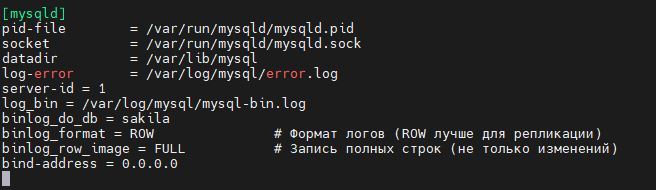
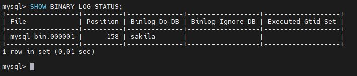

# Домашнее задание к занятию "`Репликация и масштабирование. Часть 1`" - `Горелов Николай`


### Задание 1

На лекции рассматривались режимы репликации master-slave, master-master, опишите их различия.

*Ответить в свободной форме.*

---

### Решение 1. Режимы репликации: master-slave и master-master

#### Master-Slave:
- **Описание:**  
  В режиме master-slave один сервер (master) принимает запросы на запись и чтение, а другой сервер (slave) только реплицирует данные с master и может использоваться для чтения.
- **Особенности:**
  - Запись данных происходит только на master.
  - Slave синхронизируется с master и может использоваться для балансировки нагрузки на чтение.
  - Если master выходит из строя, требуется ручное переключение на slave.
- **Использование:**  
  Подходит для сценариев, где требуется масштабирование чтения и резервирование данных.

#### Master-Master:
- **Описание:**  
  В режиме master-master оба сервера могут принимать запросы на запись и чтение, а также реплицировать данные друг с другом.
- **Особенности:**
  - Запись данных может происходить на любом из серверов.
  - Требуется тщательная настройка для избежания конфликтов при одновременной записи на оба сервера.
  - Если один сервер выходит из строя, другой продолжает работать.
- **Использование:**  
  Подходит для сценариев, где требуется высокая доступность и распределение нагрузки на запись.

---

### Задание 2

Выполните конфигурацию master-slave репликации, примером можно пользоваться из лекции.

*Приложите скриншоты конфигурации, выполнения работы: состояния и режимы работы серверов.*

---

### Решение 2. Конфигурация Master-Slave репликации

#### Шаги для настройки Master-Slave:

1. **Настройка Master:**
   - Открываем в режиме редактирования конфигурационный файл MySQL на master-сервере (`/etc/mysql/mysql.conf.d/mysqld.cnf`):
     ```ini
     [mysqld]
     server-id = 1                           # Уникальный ID мастера
     log_bin = /var/log/mysql/mysql-bin.log  # Включение бинарного лога
     binlog_format = ROW                     # Формат логов (ROW лучше для репликации)
     binlog_row_image = FULL                 # Запись полных строк (не только изменений)
     binlog_do_db = sakila                   # (Опционально) Реплицировать только определенную БД
     bind-address = 0.0.0.0
     ```



   - Перезапускаем MySQL:
     ```bash
     sudo systemctl restart mysql
     ```
   - Создаём пользователя для репликации:
     ```sql
     CREATE USER 'replica'@'%' IDENTIFIED WITH 'caching_sha2_password' BY 'P@$$w0rd';
     GRANT REPLICATION SLAVE ON *.* TO 'replica'@'%';
     ALTER USER 'replica'@'%' REQUIRE SSL;    -- Обязательно для MySQL 8.0+
     FLUSH PRIVILEGES;
     ```
   - Получаем текущую позицию бинарного лога:
     ```sql
     SHOW BINARY LOG STATUS;
     ```


     Необходимо запомнить и записать значения `File` и `Position`, далее эти значения потребуются.

2. **Настройка Slave:**
   - Теперь открываем  на редактирование конфигурационный файл MySQL на slave-сервере (`/etc/mysql/mysql.conf.d/mysqld.cnf`):
     
     ```ini
     [mysqld]
     server-id = 2
     relay_log = /var/log/mysql/mysql-relay-bin.log
     ```
   - Перезапускаем MySQL:
     ```bash
     sudo systemctl restart mysql
     ```
   - Настраиваем репликацию:
     ```sql
     CHANGE REPLICATION SOURCE TO
       SOURCE_HOST='192.168.220.139',
       SOURCE_USER='replica',
       SOURCE_PASSWORD='P@$$w0rd',
       SOURCE_PORT=3306,
       SOURCE_LOG_FILE='mysql-bin.000003', -- SHOW MASTER STATUS
       SOURCE_LOG_POS=1586,                -- SHOW MASTER STATUS
       SOURCE_SSL=1;                       -- Обязательно для MySQL 8.4
     ```
   - Запускаем репликацию:
     ```sql
     START REPLICA;
     ```

3. **Проверка состояния репликации:**
   - На slave-сервере нужно выполнить:
     ```sql
     SHOW REPLICA STATUS\G;
     ```
     Стоит убедиться, что `Slave_IO_Running` и `Slave_SQL_Running` имеют значение `Yes`.
     `Last_IO_Error: ""` Должно быть пусто.


---

## Дополнительные задания (со звёздочкой*)
Эти задания дополнительные, то есть не обязательные к выполнению, и никак не повлияют на получение вами зачёта по этому домашнему заданию. Вы можете их выполнить, если хотите глубже шире разобраться в материале.

---

### Задание 3* 

Выполните конфигурацию master-master репликации. Произведите проверку.

*Приложите скриншоты конфигурации, выполнения работы: состояния и режимы работы серверов.*

---

### Решение 3*. Конфигурация Master-Master репликации

#### Шаги для настройки Master-Master:

1. **Настройка первого Master:**
   - Отредактируем конфигурационный файл MySQL на первом сервере (`/etc/mysql/mysql.conf.d/mysqld.cnf`):
     ```ini
     [mysqld]
     server-id = 1
     log_bin = /var/log/mysql/mysql-bin.log
     binlog_do_db = sakila
     ```
   - Перезапускаем MySQL:
     ```bash
     sudo systemctl restart mysql
     ```
   - Создаем пользователя для репликации:
     ```sql
     CREATE USER 'replica'@'%' IDENTIFIED WITH 'caching_sha2_password' BY 'P@$$w0rd';
     GRANT REPLICATION SLAVE ON *.* TO 'replica'@'%';
     ALTER USER 'replica'@'%' REQUIRE SSL;    -- Обязательно для MySQL 8.0+
     FLUSH PRIVILEGES
     ```
   - Получаем текущую позицию бинарного лога:
     ```sql
     SHOW BINARY LOG STATUS;
     ```


2. **Настройка второго Master:**
   - Открываем и редактируем конфигурационный файл MySQL на втором сервере (`/etc/mysql/mysql.conf.d/mysqld.cnf`):
     ```ini
     [mysqld]
     server-id = 2
     log_bin = /var/log/mysql/mysql-bin.log
     binlog_do_db = sakila
     ```
   - Перезапускаем MySQL:
     ```bash
     sudo systemctl restart mysql
     ```
   - Создаем пользователя для репликации:
     ```sql
     CREATE USER 'replica'@'%' IDENTIFIED WITH 'caching_sha2_password' BY 'P@$$w0rd';
     GRANT REPLICATION SLAVE ON *.* TO 'replica'@'%';
     ALTER USER 'replica'@'%' REQUIRE SSL;    -- Обязательно для MySQL 8.0+
     FLUSH PRIVILEGES
     ```
   - Получаем текущую позицию бинарного лога:
     ```sql
     SHOW BINARY LOG STATUS;
     ```


3. **Настройка репликации между серверами:**
   - На первом сервере:
     ```sql
     CHANGE REPLICATION SOURCE TO
       SOURCE_HOST='192.168.220.141',
       SOURCE_USER='replica',
       SOURCE_PASSWORD='P@$$w0rd',
       SOURCE_PORT=3306,
       SOURCE_LOG_FILE='mysql-bin.000001', -- SHOW MASTER STATUS второго сервера
       SOURCE_LOG_POS=158,                 -- SHOW MASTER STATUS второго сервера
       SOURCE_SSL=1;
     START REPLICA;
     ```

   - На втором сервере:
     ```sql
     CHANGE REPLICATION SOURCE TO
       SOURCE_HOST='192.168.220.139',
       SOURCE_USER='replica',
       SOURCE_PASSWORD='P@$$w0rd',
       SOURCE_PORT=3306,
       SOURCE_LOG_FILE='mysql-bin.000004', -- SHOW MASTER STATUS первого сервера
       SOURCE_LOG_POS=376,                 -- SHOW MASTER STATUS первого сервера
       SOURCE_SSL=1;
     START REPLICA;     
     ```

4. **Проверка состояния репликации:**
   - На обоих серверах выполняем:
     ```sql
     SHOW REPLICA STATUS\G;
     ```
     Убеждаемся, что `Slave_IO_Running` и `Slave_SQL_Running` имеют значение `Yes`.
     `Last_IO_Error: ""` Должно быть пусто.

#### Скриншоты:


---